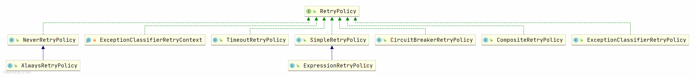

#spring-retry
> 针对于异常场景的重试机制

## 官方文档
* https://github.com/spring-projects/spring-retry
* https://docs.spring.io/spring-batch/docs/current/reference/html/retry.html

## 原理

### 核心接口
#### RetryPolicy：重试策略

```java
public interface RetryPolicy extends Serializable {
    
    /**
    * 是否能够重试
    */
    boolean canRetry(RetryContext context);
    
    /**
    * 获取重试上下文
    */
    RetryContext open(RetryContext parent);
    
    /**
    * 关闭重试
    */  
    void close(RetryContext context);
    
    /**
    * 注册异常
    */
    void registerThrowable(RetryContext context, Throwable throwable);

}

```
#### 策略类脉络



#### RetryContext：重试上下文


#### BackOffPolicy：回退策略


#### RetryTemplate：重试接口

2. 